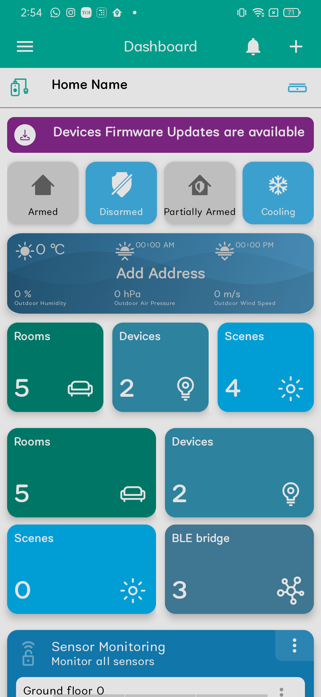
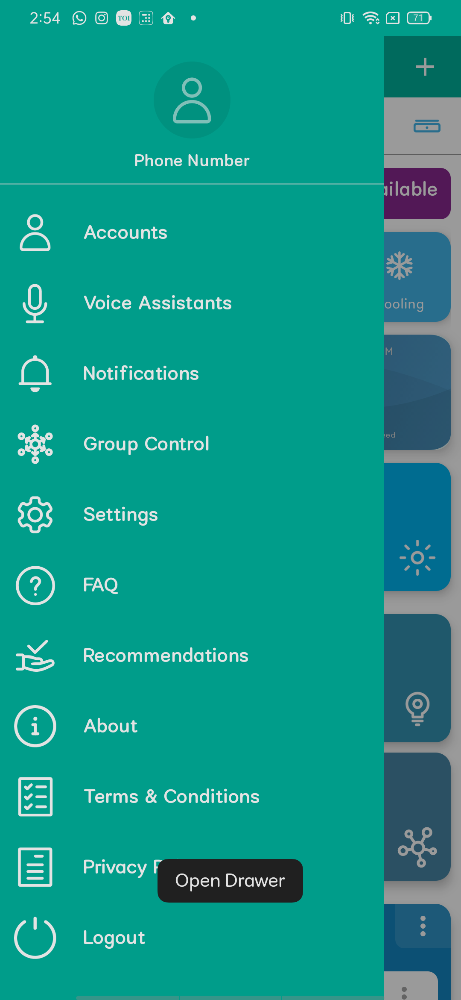
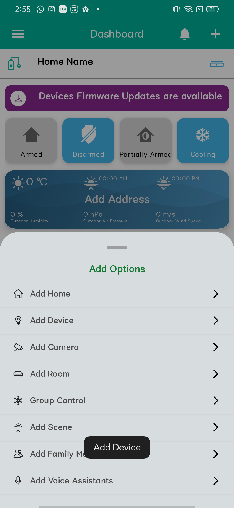

# JetpackComposeUI
Jetpack Compose UI is a modern toolkit for building native Android user interfaces. It simplifies and accelerates UI development with less code, powerful tools, and intuitive Kotlin APIs. This declarative framework allows developers to easily create and manage UI components, ensuring a seamless and responsive user experience.

Using Jetpack Compose, I have created some sample UIs.

# Features Used
1- JetPack Compose
2- Kotlin 
3- Compose AppToolbar
4- Compose BottomSheet
5- Compose ElevatedCard

<table>
  <tr>
    <td></td>
    <td></td>
    <td></td>
  </tr>
 </table>
